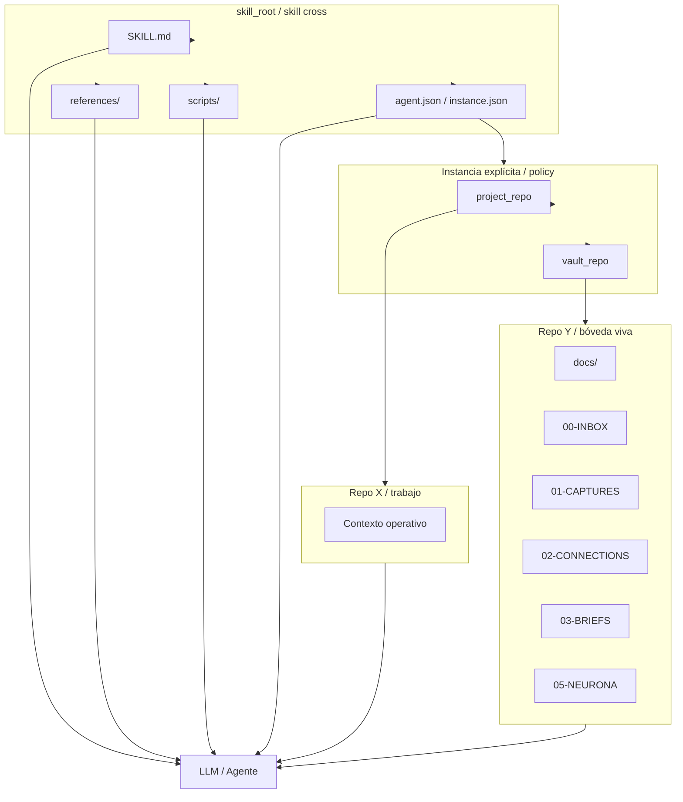

# Soporte visual de diagrama multi-repo y gobernanza

## Sharpened

El patrón multi-repo debe representarse como contrato, instancia, contexto y bóveda separados para hacer visible que `docs/` es la bóveda viva y que la raíz no debe contaminarse.

## Raw Capture

Quiero una nota de soporte visual para revisar con claridad el escenario multi-repo del skill `$mem`: un repo del skill cross, un repo X de trabajo y un repo Y que actúa como bóveda viva del proyecto.

La idea es usar esa nota como base para ver gráficamente cómo se relacionan:

- el contrato reusable del skill;
- la referencia o plantilla de instancia;
- el contexto operativo del agente;
- el repo del proyecto donde se trabaja;
- y la bóveda viva donde vive la memoria operativa.

Lo que necesito visualizar es la diferencia entre:

1. instalar o hacer checkout del skill cross;
2. declarar la instancia explícita;
3. asignar el repo de trabajo;
4. asignar el repo o carpeta descendiente que actúa como bóveda;
5. y evitar mezclar memorias por defecto.

Esta nota debe servir como soporte gráfico para una futura neurona o brief que explique la gobernanza multi-repo sin ambigüedad.

La intención no es sólo documentar el flujo, sino dejar un artefacto que pueda convertirse en diagrama o referencia visual para entender:

- qué vive en el skill cross;
- qué vive en el repo de trabajo;
- qué vive en la bóveda;
- y cómo se resuelve la instancia sin contaminar la raíz ni cruzar memoria accidentalmente.

La nota debería ayudarnos a producir una representación visual simple del patrón:

- contrato;
- instancia;
- contexto;
- bóveda;
- y operación del LLM.

Si este soporte visual madura, luego puede subir a `01-CAPTURES/patterns/` o a una conexión, pero por ahora debe quedarse como RAW en el inbox para usarlo como apoyo gráfico del diseño.

## Soporte visual

### ASCII

```text
                 +----------------------------------+
                 |         skill_root               |
                 |  SKILL.md                        |
                 |  references/                     |
                 |  scripts/                        |
                 |  agent.json / instance.json      |
                 +-----------------+----------------+
                                   |
                                   v
                 +-----------------+----------------+
                 |   Instancia explícita / policy   |
                 |  project_repo + vault_repo       |
                 +--------+----------------+--------+
                          |                |
                          |                |
                          v                v
                 +--------------+   +----------------+
                 |  Repo X      |   |    Repo Y      |
                 |  trabajo     |   |  bóveda viva   |
                 +--------------+   +----------------+
                          \              /
                           \            /
                            v          v
                       +----------------------+
                       |    LLM / Agente      |
                       |   coordinación       |
                       +----------------------+
```

### Mermaid


