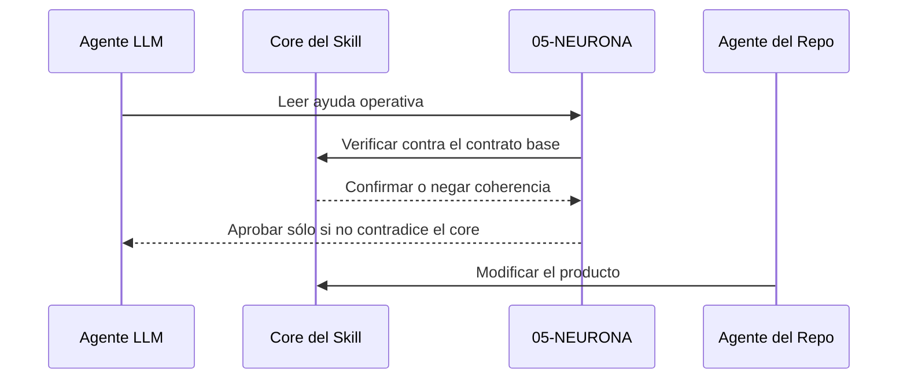

# Criterios para no confundir operación con implementación

## Propósito

Esta neurona fija la frontera entre usar `$mem` y modificar `$mem`. Evita que la guía operativa invada la conversación de desarrollo.

## Regla

Hay dos planos distintos:

- el plano operativo, donde el agente LLM usa el skill para gestionar memoria;
- el plano de implementación, donde el dueño o desarrollador modifica el skill.

No deben mezclarse. La ayuda de `05-NEURONA` existe para la operación. Las decisiones de producto viven en el contrato del skill, sus referencias y su código.

## Consecuencia

Cuando una neurona de ayuda sea útil para automatización, debe:

- describir comportamiento;
- sugerir flujo;
- fijar criterios de madurez;
- y mantenerse agnóstica respecto a la implementación.

No debe decirle al desarrollador cómo cambiar el skill, salvo que la propia doctrina del proyecto lo requiera como cambio de contrato.

## Verificación LLM

Antes de aceptar una neurona de ayuda como doctrina operativa, el LLM debe comprobar dos cosas:

- que no contradiga el core del skill;
- que su alcance sea operativo y no de implementación.

Si la idea propone cómo usar el módulo, puede vivir en `05`. Si propone cómo cambiar el producto, debe quedarse en el plano de implementación o elevarse sólo como cambio de contrato explícito.

## Secuencia

## Relacionado

- [Flujo completo de automatización para agentes LLM](flujo-completo-de-automatizacion-para-agentes-llm.md)
- [Cierre del loop y comportamiento esperado al cerrar](cierre-del-loop-y-comportamiento-esperado-al-cerrar.md)
