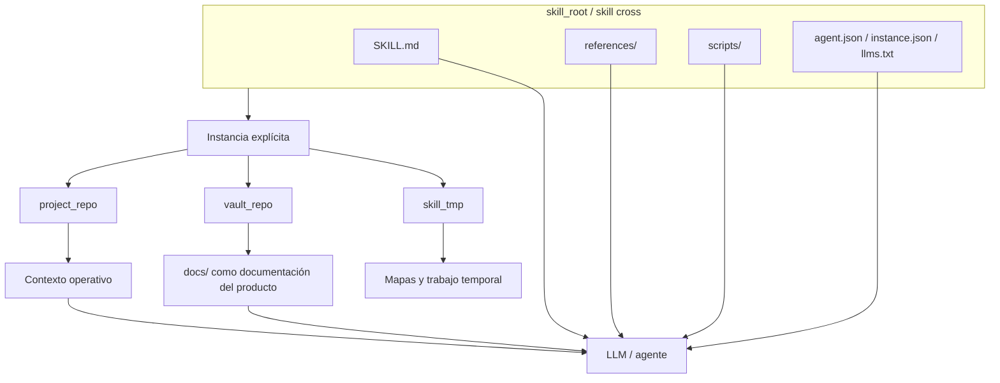

# Diagrama multi-repo y gobernanza

## Lectura

- El skill cross aporta contrato y herramientas.
- La instancia declara repo de trabajo, bóveda y memoria temporal.
- `docs/` es documentación del producto.
- La raíz del repo no es una bóveda válida.

## Relacionado

- [Gobernanza multi-instancia y bóveda descendiente](gobernanza-multi-instancia-y-boveda-descendiente.md)
- [Diagrama de arquitectura instanciable](diagrama-arquitectura-instanciable.md)
