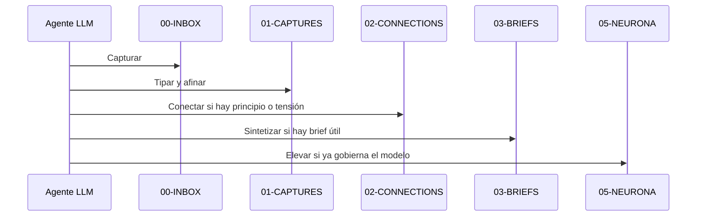

# Flujo completo de automatización para agentes LLM

## Propósito

Esta neurona describe el flujo operativo de `$mem` cuando lo usa un agente LLM. Guía el uso del módulo; no decide su implementación.

## Flujo

1. Detectar o recibir una captura cruda en `00-INBOX`.
2. Clasificar la captura en una neurona tipada de `01-CAPTURES`.
3. Evaluar si la captura debe conectarse con otras neuronas en `02-CONNECTIONS`.
4. Elevar a `03-BRIEFS` cuando la síntesis ya tenga forma de brief útil.
5. Subir a `05-NEURONA` sólo cuando el criterio ya gobierne el modelo y pueda reutilizarse como doctrina.

## Regla

El agente LLM debe tratar este flujo como una secuencia de maduración. No debe saltar de captura cruda a neurona gobernante sin evidencia suficiente.

## Secuencia

## Relación con la implementación

Esta guía no modifica el contrato del skill ni compite con el agente que lo implementa. Sirve al operador del módulo. La implementación vive en otro plano.

## Relacionado

- [Cierre del loop y comportamiento esperado al cerrar](cierre-del-loop-y-comportamiento-esperado-al-cerrar.md)
- [La arquitectura del proyecto ya es sólida, pero necesita endurecer su implementación](../01-CAPTURES/patterns/20260515-082227-arquitectura-conceptual-madurez-doctrinal-y-referencias-agnosticas.md)
