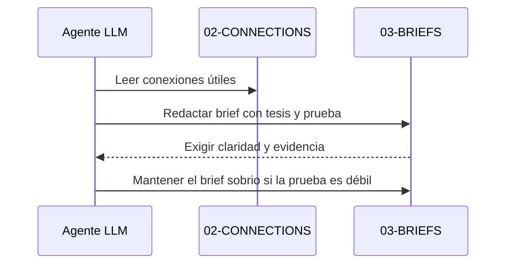

# Guía de briefs para agentes LLM

## Propósito

Esta neurona fija cuándo una red de capturas y conexiones ya tiene forma de brief útil.

## Regla

Un brief debe salir sólo cuando hay:

- una tesis central clara;
- prueba concreta;
- transformación del lector;
- y ganchos/cierres que sirvan a comunicación o pensamiento.

## Criterio

Si la evidencia es débil, el brief debe decirlo. No debe compensar falta de prueba con adornos retóricos.

## Secuencia

## Relacionado

- [Brief: $mem como producto instanciable y referencias agnósticas](../03-BRIEFS/20260515-080000-mem-como-producto-instanciable-y-referencias-agnosticas.md)
- [Flujo completo de automatización para agentes LLM](flujo-completo-de-automatizacion-para-agentes-llm.md)
