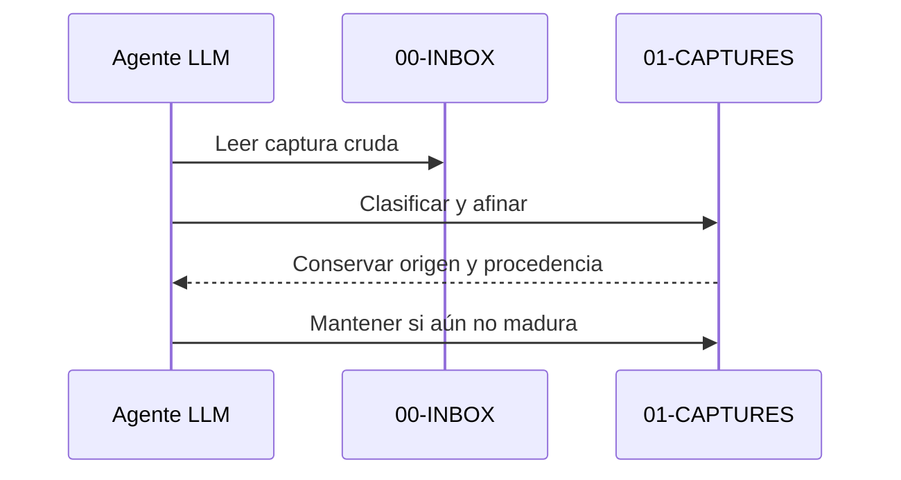

# Guía de captura para agentes LLM

## Propósito

Esta neurona guía cómo pasar de una captura cruda a una captura tipada sin perder procedencia ni forzar síntesis.

## Regla

- Mantener el texto original intacto.
- Clasificar por el tipo de captura más útil, no por tema.
- Afinar en una sola oración verificable.
- Guardar siempre `source_file` cuando la captura derive del inbox.

## Criterio

Si la captura aún depende de contexto implícito, no debe inflarse a doctrina. Debe permanecer como captura procesada hasta que tenga claridad para conectar, sintetizar o subir de nivel.

## Secuencia

## Relacionado

- [Flujo completo de automatización para agentes LLM](flujo-completo-de-automatizacion-para-agentes-llm.md)
- [Criterios para no confundir operación con implementación](criterios-para-no-confundir-operacion-con-implementacion.md)
