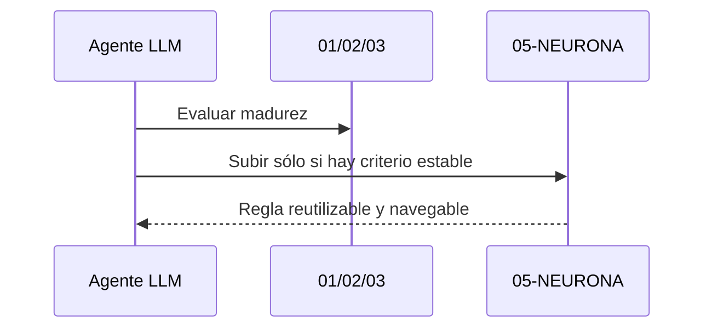

# Guía de elevación a neurona

## Propósito

Esta neurona indica cuándo una captura, conexión o brief ya debe subir a `05-NEURONA` como criterio del proyecto.

## Regla

Sube a `05` sólo cuando la idea:

- define una regla;
- aclara una frontera;
- explica un modo de uso;
- o estabiliza cómo leer la red del proyecto.

## Criterio

Si la idea sólo ayuda a pensar, permanece en `01`, `02` o `03`. Si ya gobierna el modelo, entonces merece `05`.

## Secuencia

## Relacionado

- [Cierre del loop y comportamiento esperado al cerrar](cierre-del-loop-y-comportamiento-esperado-al-cerrar.md)
- [Criterios para no confundir operación con implementación](criterios-para-no-confundir-operacion-con-implementacion.md)
