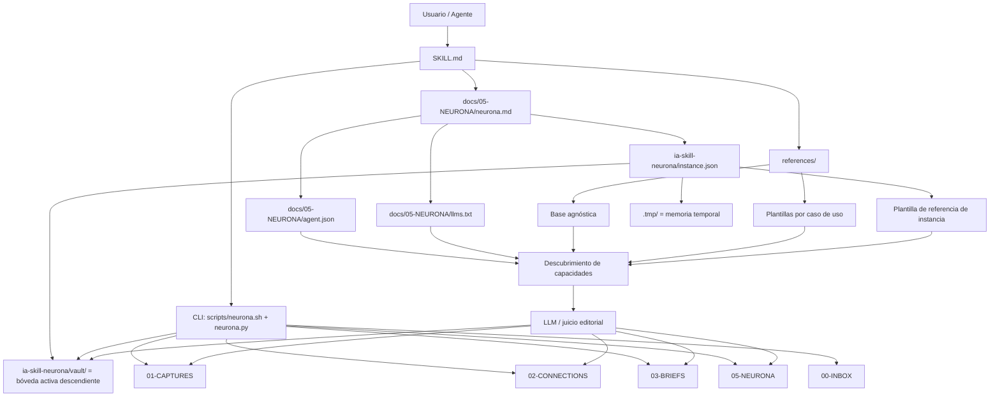

# Diagrama de arquitectura instanciable de `$mem`

## Lectura

- `SKILL.md` define el contrato central.
- `references/` define doctrina base agnóstica y plantillas de ajuste.
- `instance.json` declara la instancia activa y sus bóvedas nombradas.
- `agent.json` y `llms.txt` exponen el mapa de capacidades.
- La CLI mueve y organiza la bóveda.
- El LLM decide adaptación, curaduría y síntesis.
- La raíz del repo no es una bóveda válida; la instancia debe apuntar a un descendiente explícito.

## Relacionado

- [Neurona del Proyecto](neurona.md)
- [Modelo de instanciación del skill](modelo-de-instanciacion-del-skill.md)
- [Cómo otro agente llegaría a la misma conclusión](como-otro-agente-llegaria-a-la-misma-conclusion.md)
- [Estructura de la Bóveda](vault-structure.md)
